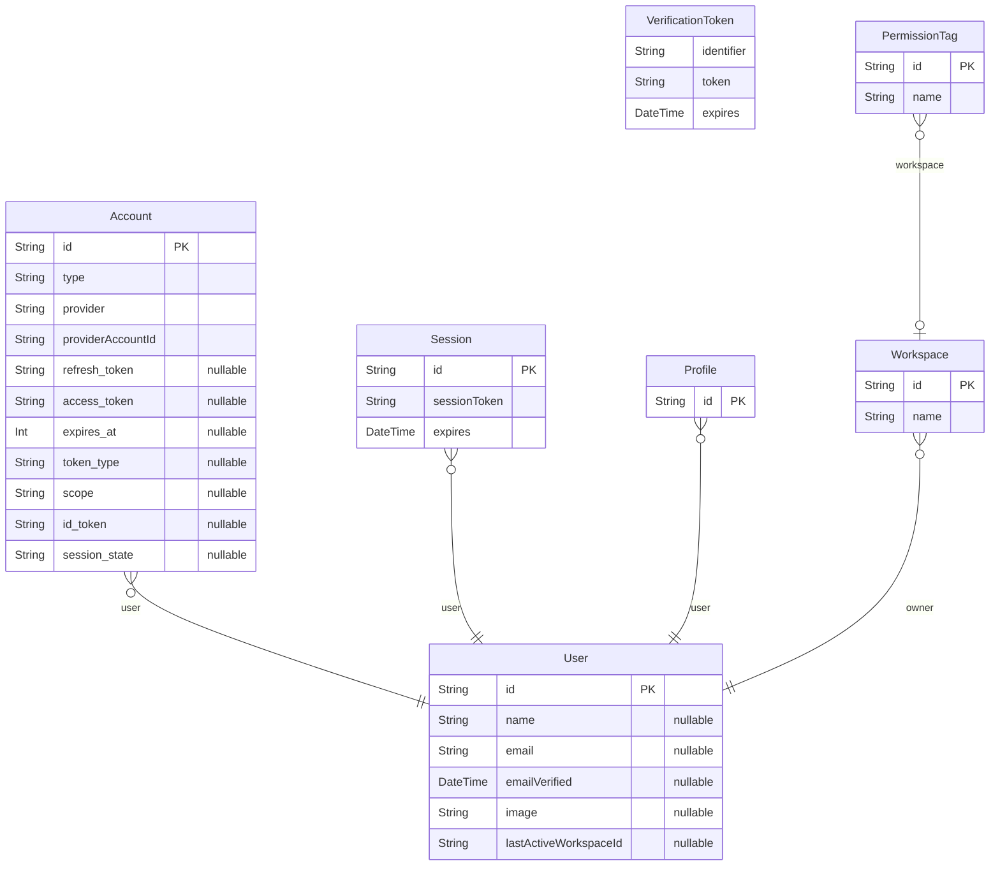

```mermaid
erDiagram

  Account {
    String id PK 
    String type  
    String provider  
    String providerAccountId  
    String refresh_token  "nullable"
    String access_token  "nullable"
    Int expires_at  "nullable"
    String token_type  "nullable"
    String scope  "nullable"
    String id_token  "nullable"
    String session_state  "nullable"
    }
  

  Session {
    String id PK 
    String sessionToken  
    DateTime expires  
    }
  

  User {
    String id PK 
    String name  "nullable"
    String email  "nullable"
    DateTime emailVerified  "nullable"
    String image  "nullable"
    String lastActiveWorkspaceId  "nullable"
    }
  

  VerificationToken {
    String identifier  
    String token  
    DateTime expires  
    }
  

  Profile {
    String id PK 
    }
  

  PermissionTag {
    String id PK 
    String name  
    }
  

  Workspace {
    String id PK 
    String name  
    }
  
    Account o{--|| User : "user"
    Session o{--|| User : "user"
    Profile o{--|| User : "user"
    PermissionTag o{--|o Workspace : "workspace"
    Workspace o{--|| User : "owner"
```
